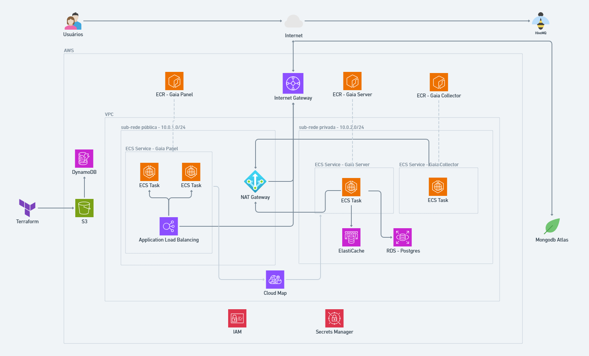

<h1 align="center">Gaia IAC</h1>

<p align="center">
  <strong>Infraestrutura como Código para o Ecossistema Gaia</strong><br>
  Automatização completa da infraestrutura AWS usando Terraform
</p>

---

## 📋 Índice

- [Visão Geral](#visão-geral)
- [Diagrama da Arquitetura](#diagrama-da-arquitetura)
- [Arquitetura da Infraestrutura](#arquitetura-da-infraestrutura)
  - [1. A Fundação: Rede Segura (VPC)](#1-a-fundação-rede-segura-vpc)
  - [2. A Camada Pública: Interação com o Mundo](#2-a-camada-pública-interação-com-o-mundo)
  - [3. A Camada Privada: O "Cofre" Seguro](#3-a-camada-privada-o-cofre-seguro)
  - [4. A "Cola": Comunicação e Segurança](#4-a-cola-comunicação-e-segurança)
  - [5. A Automação: O "Piloto Automático"](#5-a-automação-o-piloto-automático)
- [Componentes Implementados](#componentes-implementados)
- [Como Usar](#como-usar)
- [Estrutura do Projeto](#estrutura-do-projeto)

---

## 🎯 Visão Geral

Sua infraestrutura na AWS foi projetada para hospedar um ecossistema de aplicações (Gaia) de forma segura e escalável. Ela utiliza um modelo de **"defesa em camadas"**, separando os serviços que precisam ser públicos dos serviços de backend e bancos de dados, que permanecem privados e protegidos. Todo o ambiente é gerenciado como código (IaC) com Terraform e implantado automaticamente com pipelines de CI/CD no GitHub Actions.

---

## 📊 Diagrama da Arquitetura



---

## 🏗️ Arquitetura da Infraestrutura

### 1. A Fundação: Rede Segura (VPC)

A base de toda a sua infraestrutura é uma **Virtual Private Cloud (VPC)** customizada, que funciona como sua própria rede isolada na AWS. Ela é dividida em:

- **Sub-redes Públicas**: Duas sub-redes em Zonas de Disponibilidade diferentes que se comunicam com a internet através de um Internet Gateway. É a "zona desmilitarizada" (DMZ) da sua arquitetura.
- **Sub-redes Privadas**: Duas sub-redes também em Zonas de Disponibilidade diferentes que não têm acesso direto da internet. Para que os serviços aqui possam fazer chamadas para fora (ex: baixar atualizações), eles usam um NAT Gateway que fica na sub-rede pública.

### 2. A Camada Pública: Interação com o Mundo

Os únicos componentes que interagem diretamente com a internet são:

- **Application Load Balancer (ALB)**: É a porta de entrada para usuários. Ele recebe todo o tráfego web, o distribui para garantir alta disponibilidade e o encaminha para o Gaia Panel.
- **Serviço Gaia Panel (Frontend)**: Sua aplicação Remix/frontend roda em contêineres gerenciados pelo ECS Fargate nas sub-redes públicas. É a interface com a qual seus usuários interagem.
- **Instância EC2 com HiveMQ**: Seu broker MQTT roda em uma instância EC2 na sub-rede pública. Isso é necessário para que seus dispositivos IoT, que estão na internet, possam se conectar e publicar dados.

### 3. A Camada Privada: O "Cofre" Seguro

Esta é a camada principal e protegida, inacessível pela internet.

- **Serviço Gaia Server (Backend)**: Sua API NestJS roda em contêineres Fargate nas sub-redes privadas. Ela contém sua lógica de negócios principal.
- **Serviço Gaia Collector**: Uma aplicação Node.js, também em Fargate na sub-rede privada, cuja única função é se conectar ao broker HiveMQ para "escutar" e coletar os dados dos dispositivos IoT.
- **Banco de Dados (RDS PostgreSQL)**: Sua base de dados relacional fica na sub-rede privada, garantindo que apenas serviços autorizados (neste caso, o Gaia Server) possam acessá-la.
- **Banco de Dados (DocumentDB)**: O banco NoSQL para armazenar os dados brutos do Gaia Collector também reside na sub-rede privada.
- **Função Lambda (Gaia Parser)**: Uma função serverless que também opera dentro da rede privada. Ela é acionada periodicamente pelo EventBridge para ler dados do DocumentDB, processá-los e salvá-los no PostgreSQL.

### 4. A "Cola": Comunicação e Segurança

- **AWS Cloud Map (Service Discovery)**: É o serviço que possibilita a comunicação interna. Quando o Gaia Panel (público) precisa falar com o Gaia Server (privado), ele usa um endereço de DNS privado fornecido pelo Cloud Map (ex: `http://dev-gaia-server-sd.dev.gaia.local`), e a AWS direciona o tráfego de forma segura dentro da VPC.
- **Security Groups**: Atuam como firewalls em cada camada. O ALB só fala com o Panel, o Panel só fala com o Server, e o Server só fala com o Banco de Dados, criando um fluxo de tráfego estritamente controlado.
- **IAM (Identity and Access Management)**: Gerencia todas as permissões. As roles do GitHub Actions permitem que suas pipelines de CI/CD interajam com a AWS, e as roles do ECS dão as permissões necessárias para suas aplicações rodarem e se comunicarem.
- **AWS Secrets Manager**: Armazena de forma centralizada e segura todas as credenciais e chaves de API, que são injetadas nas suas aplicações em tempo de execução.

### 5. A Automação: O "Piloto Automático"

- **Terraform (IaC)**: Todo o sistema descrito acima é definido como código em um repositório (gaia-iac), garantindo consistência e rastreabilidade. O estado do Terraform é armazenado de forma segura no S3 com bloqueio de estado via DynamoDB.
- **GitHub Actions (CI/CD)**: Você tem pipelines separadas para cada aplicação (server, panel) e para a infraestrutura (iac). Qualquer alteração no código dispara a pipeline correspondente, que automaticamente constrói, testa e implanta a nova versão na AWS sem intervenção manual.

---

## 🧩 Componentes Implementados

### ✅ Atualmente Disponíveis

- **🌐 VPC e Networking**: VPC customizada com subnets públicas e privadas
- **🔒 Security Groups**: Firewall configurado em camadas
- **⚖️ Application Load Balancer**: Distribuição de tráfego HTTP
- **🐳 ECS Fargate**: Orquestração de containers serverless
- **🗄️ RDS PostgreSQL**: Banco de dados relacional
- **📦 ECR**: Repositórios para imagens Docker
- **🔍 Service Discovery**: Comunicação interna via AWS Cloud Map
- **🔐 Secrets Manager**: Gerenciamento seguro de credenciais
- **👤 IAM Roles**: Permissões para GitHub Actions e ECS
- **📊 CloudWatch**: Logs centralizados

### 🚧 Planejados para Implementação

- **📡 HiveMQ em EC2**: Broker MQTT para dispositivos IoT
- **🔄 Gaia Collector**: Serviço de coleta de dados IoT
- **📄 DocumentDB**: Banco NoSQL para dados brutos
- **⚡ Lambda Functions**: Processamento serverless (Gaia Parser)
- **⏰ EventBridge**: Agendamento de tarefas
- **🔄 Auto Scaling**: Escalabilidade automática
- **🛡️ WAF**: Web Application Firewall
- **📈 CloudWatch Alarms**: Monitoramento e alertas

---

## 🚀 Como Usar

### Pré-requisitos

- AWS CLI configurado
- Terraform >= 1.0
- Credenciais AWS com permissões adequadas

### Implantação

1. **Clone o repositório**:
   ```bash
   git clone https://github.com/CtrI-Alt-Del/gaia-iac.git
   cd gaia-iac/src
   ```

2. **Configure o workspace do Terraform**:
   ```bash
   terraform workspace new dev  # ou staging, production
   terraform workspace select dev
   ```

3. **Inicialize o Terraform**:
   ```bash
   terraform init
   ```

4. **Planeje a implantação**:
   ```bash
   terraform plan
   ```

5. **Aplique as mudanças**:
   ```bash
   terraform apply
   ```

### Variáveis de Ambiente

As principais variáveis podem ser configuradas em `variables.tf`:

- `aws_region`: Região AWS (padrão: us-east-1)
- `gaia_panel_container_port`: Porta do frontend (padrão: 3000)
- `gaia_server_container_port`: Porta do backend (padrão: 3333)
- `gaia_server_app_mode`: Modo da aplicação (padrão: staging)

---

## 📁 Estrutura do Projeto

```
src/
├── provider.tf              # Configuração do provider AWS
├── variables.tf             # Variáveis do projeto
├── outputs.tf               # Outputs da infraestrutura
├── vpc.tf                   # VPC, subnets e security groups
├── alb.tf                   # Application Load Balancer
├── ecs.tf                   # ECS cluster e services
├── rds.tf                   # Banco de dados PostgreSQL
├── ecr.tf                   # Repositórios Docker
├── iam.tf                   # Roles e políticas IAM
├── secrets_manager.tf       # Gerenciamento de secrets
├── service_discovery.tf     # AWS Cloud Map
└── s3.tf                    # Bucket para Terraform state
```


